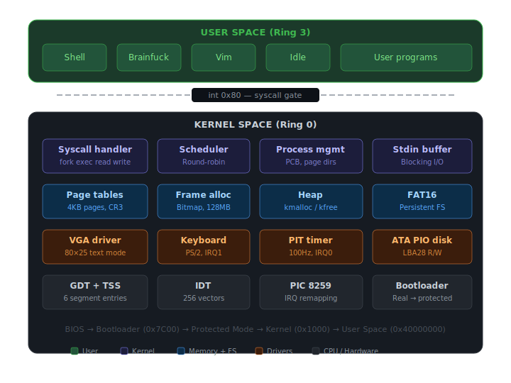

# AdamOS

A 32-bit x86 operating system built from scratch in C and x86 assembly. Named after the first man — because this is my first OS.

AdamOS boots from a custom bootloader, transitions into protected mode, and runs user-space processes with full ring 0/ring 3 separation. It includes a round-robin scheduler, virtual memory with per-process page tables, a FAT16 filesystem on an ATA disk, `fork`/`exec` process management, and a user-space shell.



## Features

**Boot & CPU Setup** — A 16-bit bootloader loads the kernel from disk via BIOS `int 0x13`, switches to 32-bit protected mode with a GDT (6 entries: null, kernel code/data, user code/data, TSS), remaps the PIC, and jumps to the kernel entry point at `0x1000`.

**Preemptive Scheduler** — A timer-driven round-robin scheduler (PIT at 100Hz, quantum of 20 ticks) manages processes through a linked list of PCBs. Each process has its own page directory, kernel stack, and file descriptor table. Context switches happen transparently via `iret`.

**Virtual Memory** — 4KB paging with per-process page directories. The kernel is identity-mapped in the first 1MB, while user processes run at virtual address `0x40000000` (code) and `0x50000000` (stack). `fork` performs a deep copy of the entire page directory.

**Syscalls** — User-space programs communicate with the kernel via `int 0x80`. Supported syscalls: `exit`, `fork`, `read`, `write`, `open`, `close`, `exec`, `ps`, `kill`, `waitpid`, and `create`.

**FAT16 Filesystem** — A persistent filesystem on a virtual ATA PIO disk. Supports reading files and directories, creating files, and writing data. The filesystem image is built with `mkfs.fat` and embedded in the OS image at LBA 2048.

**Drivers** — VGA text-mode display (80×25 with ANSI color support), PS/2 keyboard with shift handling, PIT timer, and ATA PIO disk driver (polling-based LBA28 sector read/write).

**User-Space Shell** — A ring 3 shell with commands: `ls`, `cd`, `cat`, `exec`, `fork`, `kill`, `ps`, `touch`, `vim`, `bf`, `clear`, and `help`. Child processes are launched via `fork`/`exec` with `waitpid` for synchronization.

**User-Space Programs** — A Brainfuck interpreter, a minimal text editor (vim), and an idle process — all running in ring 3 with isolated address spaces.

## Memory Map

```
Address             Description
─────────────────────────────────────────
0x00000 - 0x100000  Kernel (1MB, identity mapped, ring 0)
0x10000 - 0x90000   Kernel heap (kmalloc / kfree)
0x90000             Kernel stack top
0x40000000          User code (virtual)
0x50000000          User stack (virtual)
0xB8000             VGA text-mode buffer
```

## Building & Running

**Prerequisites:** `i686-elf-gcc`, `i686-elf-ld`, `nasm`, `qemu-system-x86_64`, `mtools` (for `mcopy` / `mkfs.fat`)

```bash
# Full build + launch QEMU
./run.sh

# Or build individually:
cd user-space && bash build-user.sh    # compile user programs
cd kernel-space && bash build-kernel.sh # compile kernel + create disk image
```

The build process compiles user-space programs into flat binaries, embeds them as linker objects in the kernel, assembles a FAT16 disk image with the shell and programs, and concatenates everything into a single `os-image.bin` that QEMU boots from.

## Project Structure

```
├── run.sh                          # Build everything and launch QEMU
├── kernel-space/
│   ├── boot/
│   │   ├── kernel-boot.asm         # 16-bit bootloader, GDT, protected mode switch
│   │   └── kernel-entry.asm        # 32-bit entry point, calls kernel_main
│   ├── cpu/
│   │   ├── gdt.c / gdt.asm         # Global Descriptor Table + TSS
│   │   ├── idt.c                   # Interrupt Descriptor Table, PIC, I/O ports
│   │   ├── exceptions.c / .asm     # CPU exception handlers (0-19)
│   │   ├── interrupts.asm          # Timer, keyboard, syscall ISR wrappers
│   │   └── syscall.c               # int 0x80 handler: fork, exec, read, write...
│   ├── drivers/
│   │   ├── screen.c                # VGA text-mode driver with ANSI color
│   │   ├── keyboard.c              # PS/2 keyboard with shift support
│   │   ├── timer.c                 # PIT timer at 100Hz
│   │   └── ata-disk.c              # ATA PIO sector read/write
│   ├── kernel/
│   │   ├── kernel.c                # Main entry: init GDT, IDT, scheduler, launch shell
│   │   ├── config.h                # All constants: memory map, GDT selectors, PIC, PIT...
│   │   ├── scheduler.c             # Round-robin scheduler with quantum preemption
│   │   ├── process-control-block.c # PCB creation, context switch (ASM)
│   │   ├── page-table.c / .asm     # Paging: map_page, create/copy/clear page directories
│   │   ├── frame.c                 # Physical frame allocator (bitmap)
│   │   ├── kmalloc.c               # First-fit heap allocator
│   │   ├── stdin.c                 # Stdin buffer with blocking read
│   │   └── types.h                 # uint32_t, registers_t, va_list
│   ├── lib/
│   │   ├── fat16.c                 # FAT16 filesystem: read, write, find, format
│   │   ├── string.c                # strcmp, strlen, itos, itohs, strtok...
│   │   ├── mem.c                   # memcpy, memset, memcmp
│   │   └── math.c                  # pow, min, max, ceil
│   ├── pch.h                       # Precompiled header (included everywhere)
│   ├── linker.ld                   # Kernel linked at 0x1000
│   └── build-kernel.sh             # Kernel build script
└── user-space/
    ├── lib/
    │   ├── syscalls.asm            # int 0x80 wrappers for all syscalls
    │   ├── lib.h                   # User-space syscall declarations
    │   └── string.h                # String + memory utilities for user programs
    ├── programs/
    │   ├── shell.c                 # Interactive shell with command dispatch
    │   ├── main.c                  # Init process: exec's the shell
    │   ├── idle.c                  # Idle loop (PID 1)
    │   ├── bf.c                    # Brainfuck interpreter
    │   └── vim.c                   # Minimal text editor
    └── build-user.sh               # User-space build script
```

## Syscall Table

| Number | Name       | Args                              | Description                         |
|--------|------------|-----------------------------------|-------------------------------------|
| 1      | `exit`     | —                                 | Terminate current process           |
| 2      | `fork`     | —                                 | Duplicate process (returns 0/child PID) |
| 3      | `read`     | fd, buf, len                      | Read from fd (stdin or file)        |
| 4      | `write`    | fd, buf, len                      | Write to fd (stdout or file)        |
| 5      | `open`     | filename                          | Open file or directory, returns fd  |
| 6      | `close`    | fd                                | Close file descriptor               |
| 7      | `ps`       | buf, max                          | List running processes              |
| 11     | `exec`     | filename, arg                     | Replace process with new binary     |
| 12     | `kill`     | pid                               | Terminate a process by PID          |
| 13     | `waitpid`  | pid                               | Block until child exits             |
| 14     | `create`   | name, data, len                   | Create a new file on disk           |

## Shell Commands

```
ls              List files in current directory
cd <dir>        Change directory
cat <file>      Print file contents
exec <file>     Run a program (replaces shell)
fork <file>     Run a program as child process
kill <pid>      Kill a process
ps              Show running processes
touch <f> <d>   Create file with content
vim <file>      Open text editor
bf <file>       Run Brainfuck program
clear           Clear the screen
help            Show available commands
```

## Technical Details

The toolchain is `i686-elf-gcc` (freestanding, no stdlib, no PIC) with `nasm` for assembly. All kernel C files include a single precompiled header (`pch.h`). There is no standard library — everything from `memcpy` to `printf`-like output is implemented from scratch.

The bootloader fits in a single 512-byte boot sector. It loads 50 sectors from disk using BIOS `int 0x13`, sets up a minimal GDT with kernel and user segments, switches to protected mode with a far jump to flush the pipeline, and calls the kernel at `0x1000`.

Process isolation is enforced through separate page directories per process. On every context switch, the scheduler saves registers into the outgoing PCB, loads registers from the incoming PCB, updates `CR3` to the new page directory, and sets the TSS kernel stack pointer. The `fork` syscall allocates new frames and copies every present user page, giving the child a complete independent copy of the parent's address space.

## License

This project is a personal learning exercise in systems programming.
